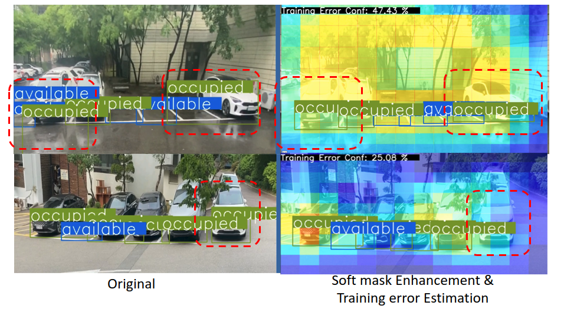

# Towards an Error-free Deep Occupancy Detector for Smart Camera Parking System

This is the source code for simulation and data ETL of the paper. Please read [the paper](https://arxiv.org/abs/2208.08220) beforehand to understand the usage of the codes. OcpDet is designed to capture the error during inference by deep learning object-detector paradigm. It can verify samples that is non-covered in the training information and enhance detection accuracy performance


## SNU-SPS dataset

This dataset was made to support the future Smart Parking System (SPS) with marked parking slots by 4 keypoints with 4 types of classes: *Available/Occupied/Illegal/Restricted*. To extract the center and width of the dataset. Please use the provided `meta.py` to extract for training set and test set. Noted that the `Test` folder is organized by parking lots and divided by day information, while the `Images` or *Train* folder is only organized by parking lots. All annoations is stored in `Annotation` folder.

The traffic information using for Parking Assignment simulation will be stored in `dense_record` folder. This information is collected from [`http://www.utic.go.kr`](http://www.utic.go.kr) which is an open Korean Traffic website (the route optimization is powered by the MaqQuest API). You can manually crawl it by yourself by providing a `road_meta.json` as follow:

```
{
  "road_locations":[
    [lat,long]
    [lat,long]
  ],
  "parking_locations":[
    [lat,long]
    [lat,long]
  ]
}
```
After collected the information, they will be analyzed and graded by `traffic_analysis.py`.
**Noted that, the MapQuest API can be updated gradually, this version may not suitable for working in a long term.**

To run simulation, please run `simulation.py` to analyze the assignment cost as described in our paper.

## Model training
Model traininig has been trained by Tensorflow Object Detection API (TOD API). After follow [this instruction for installation](https://tensorflow-object-detection-api-tutorial.readthedocs.io/en/latest/), we have to modify the configuration of this API, by running the bash file `inject_customization.sh` in `add-ons` folder (also including the template of the TOD API training pipeline `demo.config`)


## Model inference
In our code, we provide both server level and edge level inference. To run the server version, please attach the saved_model in the RELEASE and inference it by `model.py`. For the edge level, please include `jetson_inference` and the `.engine` model in RELEASE.


